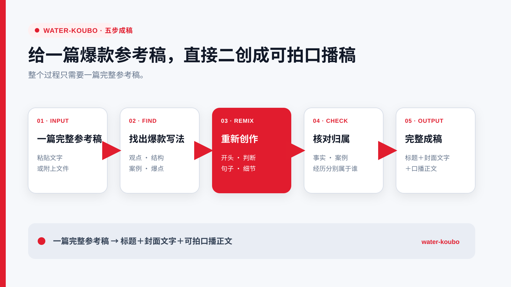

# water-koubo

[简体中文](README.md) | [繁體中文](README.zh-TW.md) | English

> An AI Skill for Chinese talking-head video creators.
>
> Give it one complete reference script and get a title, cover text, and a shoot-ready Chinese script.

  

**Supports Codex, Claude Code, WorkBuddy, DeepSeek Harness, and other agents that can read Skills.**

water-koubo was created by 老肖AI运营. The method comes from 13 years of internet operations experience and has been used in real account production.

[Quick start](#quick-start) · [Capabilities](#capabilities) · [How it works](#how-it-works) · [Open method library](#open-method-library) · [Installation](#installation) · [Full guide](#full-usage-guide)

## What water-koubo helps with

When a creator has one complete reference script worth studying, water-koubo preserves the parts that make it work and produces a fresh script with accurate attribution and shoot-ready delivery.

| Your situation | What water-koubo delivers |
|---|---|
| You want to retain the source's central idea | The topic, core judgment, and necessary limits stay accurate |
| The source works through order and progression | The structure, paragraph functions, and peak position remain intact |
| The source includes first-person experience or cases | Experience and proof are assigned to the correct owner |
| You want the result to add useful information | One valid new judgment appears early in the script |
| You want to move straight to filming | One title, cover text, and Simplified Chinese script |

## Quick start

After installation, enter this in an agent that supports Skills:

~~~text
$water-koubo
[Paste or attach one complete Chinese reference script]
Remix it into a shoot-ready Chinese talking-head script.
~~~

When the full reference is readable, water-koubo returns the finished deliverable directly.

## Capabilities

| Capability | Result |
|---|---|
| **Core judgment fidelity** | Captures what the reference is actually saying and keeps the topic on course |
| **Structure and sequence fidelity** | Preserves progression, paragraph function, and peak position |
| **A newly written opening** | Keeps the opening's job and creates a fresh way into the topic |
| **Case and attribution accuracy** | Retains the case's proof value and assigns experience and results correctly |
| **New judgment and peak progression** | Adds one valid judgment that gives the script useful new information |
| **One aligned title, cover text, and script** | Keeps all three deliverables focused on the same idea |

All six capabilities share three standards: natural aloud, shoot-ready, and factually accurate.

## Installation

Run:

~~~bash
npx -y skills add waterbrojx/water-koubo -g --all
~~~

Return to an agent that supports Skills and use **$water-koubo** with one complete reference. For ZIP import, select **skills/water-koubo**.

Current version: **1.0.0 / Unreleased**. The first public release date will be added before publication.

## How it works

~~~text
One complete reference script
      ↓
Understand why the script works
      ↓
Keep the effective structure, cases, and peak
      ↓
Rewrite judgments, sentences, and details
      ↓
Correct fact and experience attribution
      ↓
Title + cover text + shoot-ready script
~~~

1. Read the complete reference and the current request.
2. Identify the roles of its core judgment, sequence, opening, cases, peak, and closing.
3. Preserve those roles, rewrite the concrete language, and add one valid new judgment.
4. Apply the expression requirements explicitly provided in the current conversation.
5. Return only the title, cover text, and script.

## Open method library

The complete Chinese method is published in [method.md](skills/water-koubo/references/method.md). It covers four areas:

- Identifying the source's core judgment, sequence, opening, cases, peak, and closing;
- Preserving effective mechanisms while rewriting concrete judgments, sentences, and details;
- Handling first-person material, case ownership, facts, and terminology;
- Checking the new judgment, proof density, and alignment across all three deliverables.

Anyone can view and download the method or Fork the project and edit their own version. Changes in a Fork apply only to that Fork. The official version is maintained by 老肖AI运营.

Short fictional examples explain case attribution. Private scripts, client materials, and restricted source materials are excluded.

## Full usage guide

### Input

- Provide one complete reference script per request;
- Paste text directly or attach a TXT, Markdown, Word, or text-selectable PDF that the host can read completely;
- If the reference cannot be read completely, the Skill asks only for the complete reference.

### Language

- Project documentation is available in Simplified Chinese, Traditional Chinese, and English;
- All three READMEs describe the same Chinese Skill;
- Normal output is in Simplified Chinese.

### Output

Output always uses:

~~~text
标题：

封面文字：

口播正文：
~~~

A normal result contains no process commentary, scoring, or publishing advice.

### Required limits

- One complete reference per request;
- No webpage retrieval, video download, audio transcription, or scanned-image recognition;
- The Skill does not connect to the internet, request API keys, send telemetry, or update itself;
- Data handling by the host tool and selected model follows their own settings and terms.

For installation help, usage feedback, commercial licensing, or collaboration, add **Waterbro_jx** on WeChat and include **Skill** in your request.

## Changelog

### 1.0.0 · Unreleased

- First public release of water-koubo;
- Full project documentation in Simplified Chinese, Traditional Chinese, and English;
- One complete public Chinese method;
- One-reference, direct-output usage.

## Author and license

**老肖AI运营｜WeChat: Waterbro_jx**

For commercial licensing or collaboration, include **Skill** in your WeChat request.

This project uses [CC BY-NC 4.0](https://creativecommons.org/licenses/by-nc/4.0/deed.en):

- Non-commercial use is free;
- Monetized accounts, company marketing, lead generation, agency work, paid training, and paid products require separate authorization from 老肖AI运营;
- Redistribution or modification of project materials must retain attribution, license information, and a modification notice;
- Scripts generated with the Skill do not need to display 老肖AI运营 attribution, while commercial use still requires authorization;
- The 老肖AI运营 brand, banner, WeChat QR code, and their combined presentation remain separately reserved.

See [LICENSE](LICENSE) and [NOTICE](NOTICE). Official repository: [waterbrojx/water-koubo](https://github.com/waterbrojx/water-koubo).
