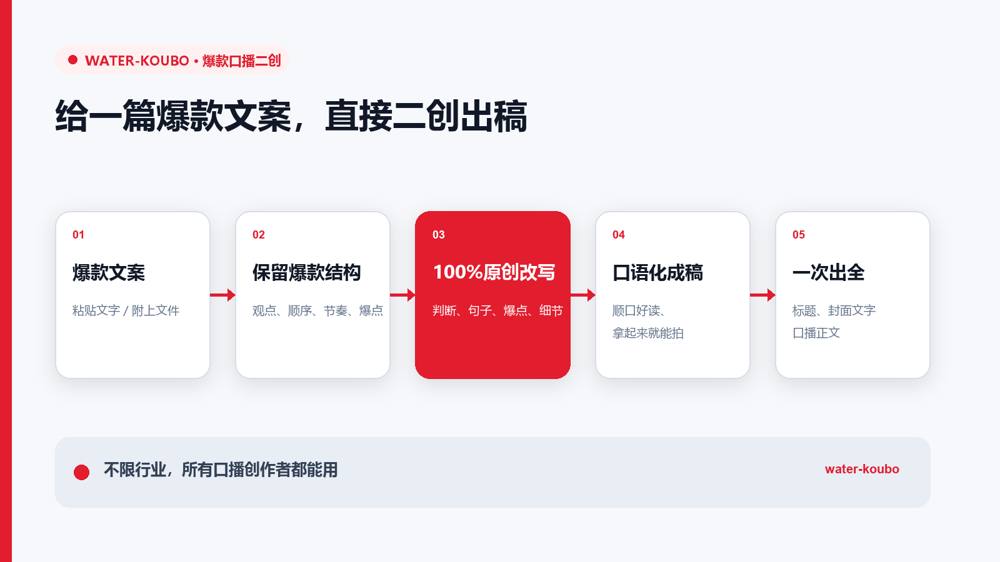

# water-koubo

简体中文 | [繁體中文](README.zh-TW.md) | [English](README.en.md)

> 短视频爆款口播二创 Skill。
>
> 给一篇完整参考稿，直接得到标题、封面文字和一篇可拍口播稿。

  

**支持：Codex、Claude Code、WorkBuddy、DeepSeek Harness，以及其他能够读取 Skills 的 Agent。**

water-koubo 由老肖AI运营创建。老肖把 13 年互联网运营经验里一直在用的口播二创方法，整理成了这个 Skill。这套方法已经用于真实账号的口播内容生产。

[快速开始](#快速开始) · [能力一览](#能力一览) · [怎样工作](#怎样工作) · [安装](#安装) · [完整说明](#完整使用说明)

## water-koubo 解决什么问题

把一篇爆款参考稿交给 water-koubo。它会保住原稿的观点、结构、案例和爆点，重写开头、判断、句子和细节，校准经历与案例归属，一次给你标题、封面文字和完整口播正文。

适合手里已经有完整参考稿，想快速二创成自己能拍内容的创作者。

## 快速开始

安装完成后，在支持 Skills 的 Agent 中输入：

~~~text
$water-koubo
【粘贴或附上一篇完整参考稿】
帮我二创成一篇可拍口播稿。
~~~

参考稿完整可读时，water-koubo 会直接交付成稿。

## 能力一览

| 能力 | 你能得到什么 |
|---|---|
| **爆款逻辑不丢** | 抓住原稿最有价值的观点、结构、案例和爆点 |
| **开头重新写** | 换一个新的开场，让第一句话更抓人 |
| **内容真正二创** | 重写判断、句子和细节，让成稿有新的信息和表达 |
| **案例归属准确** | 谁的经历写谁，参考稿里的亲历不会变成你的亲历 |
| **补出新的爆点** | 前段加进一个新的判断，让内容更有记忆点 |
| **完整成稿一次给全** | 标题、封面文字和口播正文一次交付 |

成稿读起来顺、拿起来能拍，事实和归属也对得上。

## 怎样工作

water-koubo 会按五步完成一篇二创稿：

1. **一篇完整参考稿**：读取原稿和你这次提出的要求。
2. **找出爆款写法**：抓住观点、结构、案例、爆点和结尾。
3. **重新创作**：重写开头、判断、句子和细节。
4. **核对归属**：检查事实、案例和经历分别属于谁。
5. **完整成稿**：交付标题、封面文字和口播正文。

## 安装

在终端执行：

~~~bash
npx -y skills add waterbrojx/water-koubo -g --all
~~~

安装后回到支持 Skills 的 Agent，使用 **$water-koubo** 加一篇完整参考稿即可开始。ZIP 导入时选择 **skills/water-koubo** 目录。

当前版本：**1.0.0 / Unreleased**。首次公开日期将在正式发布前写入。

## 完整使用说明

### 输入

- 每次提供一篇完整参考稿；
- 支持直接粘贴文本，以及宿主能够完整读取的 TXT、Markdown、Word 和可选中文本 PDF；
- 文件无法完整读取时，补充一份完整参考稿即可。

### 输出

~~~text
标题：

封面文字：

口播正文：
~~~

安装问题、使用反馈、商业授权或合作，请添加微信 **Waterbro_jx**，备注 **Skill**。

## 更新日志

### 1.0.0 · Unreleased

- 首次发布 water-koubo；
- 给一篇完整参考稿，直接生成标题、封面文字和可拍口播正文；
- 加入完整演示流程图。

## 作者与许可证

**老肖AI运营｜微信：Waterbro_jx**

商业授权或合作请备注 **Skill**。

本项目采用 [CC BY-NC 4.0](https://creativecommons.org/licenses/by-nc/4.0/deed.zh-hans)：

- 非商业使用免费；
- 短视频获客、代运营、收费培训或收费产品等商业使用，需要老肖AI运营单独授权；
- 再发布或修改项目材料，必须保留署名、许可证说明和修改说明；
- 使用 Skill 生成的稿件无需显示“老肖AI运营”署名，商业使用仍需授权；
- “老肖AI运营”品牌、横幅、微信二维码及其组合版式另行保留权利。

详细条款见 [LICENSE](LICENSE) 与 [NOTICE](NOTICE)。官方项目地址：[waterbrojx/water-koubo](https://github.com/waterbrojx/water-koubo)。
